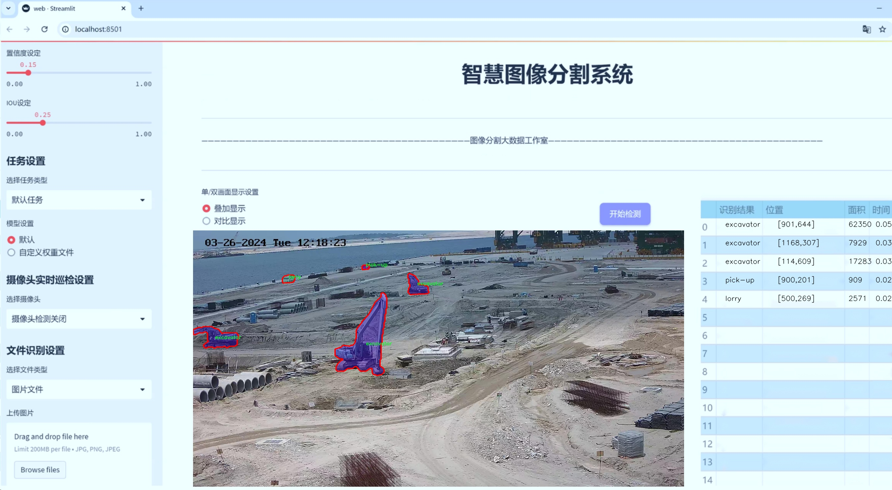
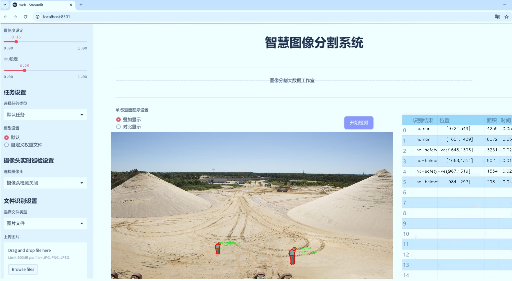
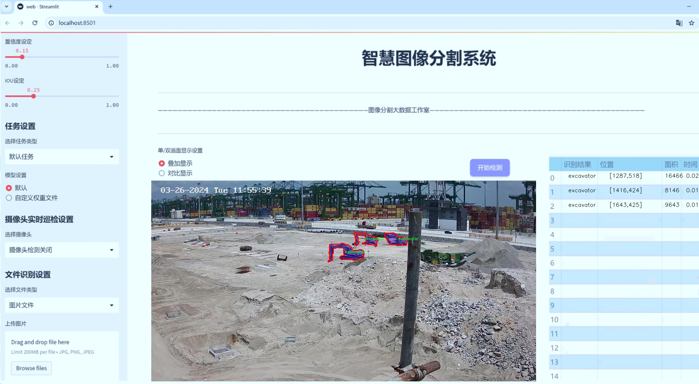
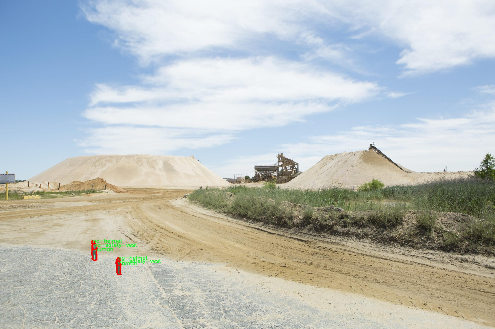
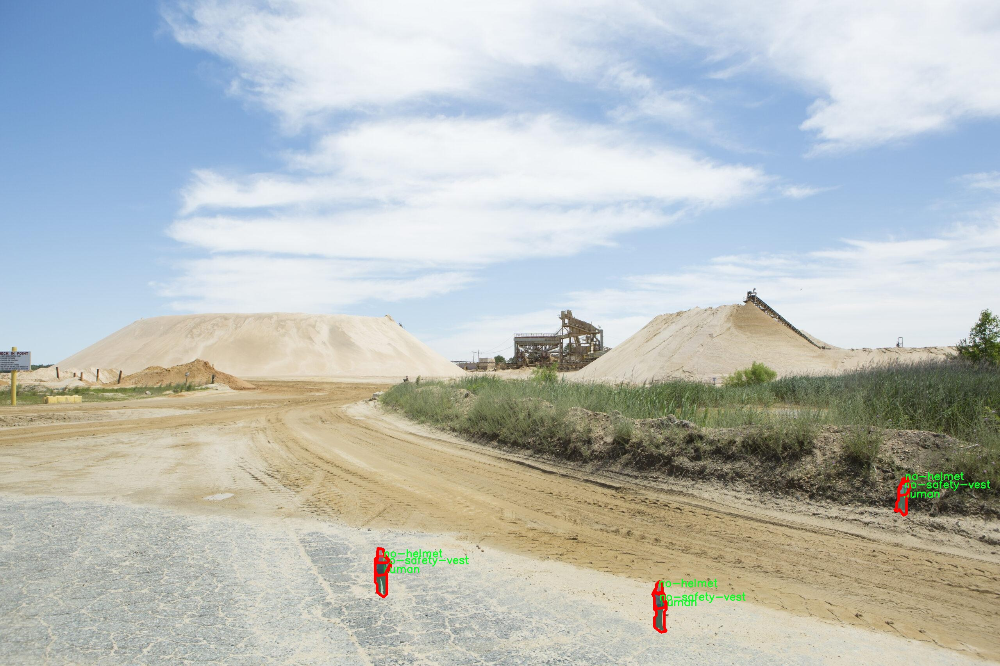
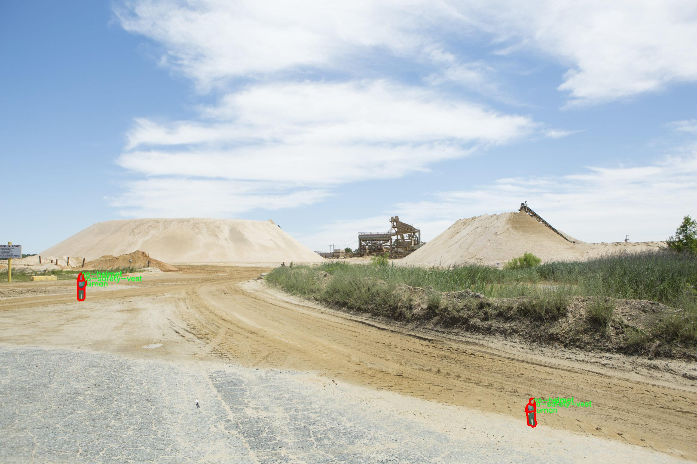
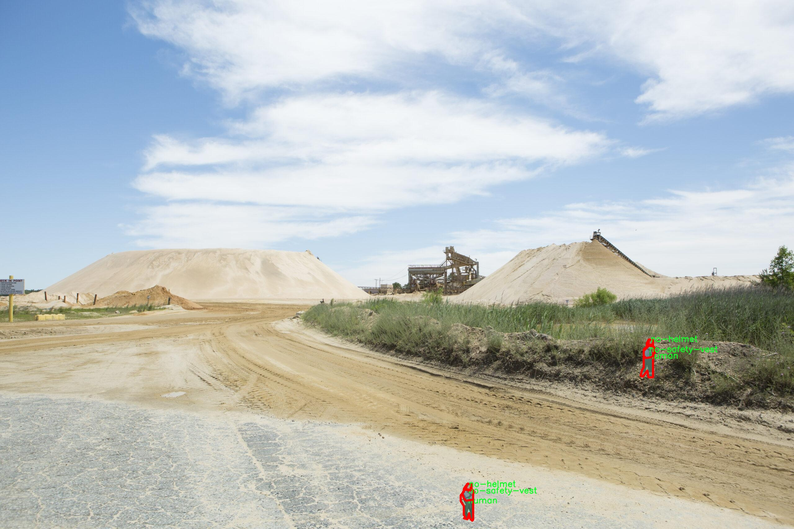
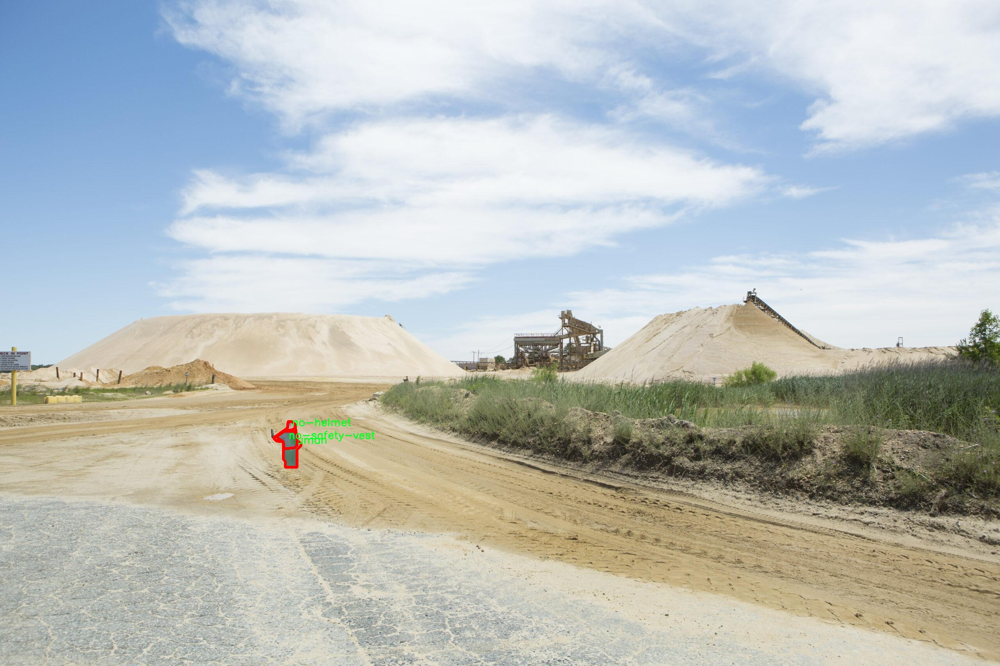

# 【智慧工地监控】建筑工地设备分割系统： yolov8-seg-efficientViT

### 1.研究背景与意义

[参考博客](https://gitee.com/YOLOv8_YOLOv11_Segmentation_Studio/projects)

[博客来源](https://kdocs.cn/l/cszuIiCKVNis)

研究背景与意义

随着城市化进程的加快，建筑行业面临着越来越多的挑战，包括安全隐患、资源浪费和环境污染等问题。为了提高建筑工地的管理效率和安全性，智慧工地的概念应运而生。智慧工地利用物联网、人工智能等先进技术，实现对建筑工地的实时监控与管理。设备分割作为智慧工地监控系统中的重要组成部分，能够有效识别和定位工地上的各种设备和人员，从而为工地的安全管理和资源调配提供重要支持。

在众多的计算机视觉技术中，基于深度学习的目标检测与分割技术近年来取得了显著进展。YOLO（You Only Look Once）系列模型因其高效的实时性和准确性，成为目标检测领域的热门选择。YOLOv8作为该系列的最新版本，进一步提升了模型的性能，尤其在小目标检测和复杂场景下的表现上有了显著改善。然而，针对建筑工地这一特定场景，YOLOv8的标准模型仍然存在一些不足之处，如对不同设备和人员的细粒度分割能力不足、在复杂背景下的识别准确率不高等。因此，改进YOLOv8以适应建筑工地设备分割的需求，具有重要的研究价值和实际意义。

本研究基于改进YOLOv8，构建一个针对建筑工地设备的分割系统，旨在通过对工地上各种设备（如起重机、挖掘机、混凝土搅拌机等）和人员（如工人、司机等）的精准识别与分割，实现对工地动态状态的实时监控。我们将使用一个包含2700张图像和24个类别的数据集，涵盖了建筑工地上常见的设备和人员。这一数据集的多样性和丰富性为模型的训练和测试提供了良好的基础，能够有效提升模型在实际应用中的表现。

通过对YOLOv8的改进，我们将重点关注以下几个方面：首先，优化模型的特征提取能力，以提高对不同设备和人员的识别精度；其次，增强模型在复杂背景下的鲁棒性，确保在各种光照和天气条件下均能保持较高的识别准确率；最后，结合实时数据处理技术，实现对工地动态状态的实时监控与反馈。这些改进将为建筑工地的安全管理提供更为可靠的技术支持，帮助管理者及时发现潜在的安全隐患，降低事故发生的风险。

综上所述，基于改进YOLOv8的智慧工地监控建筑工地设备分割系统，不仅具有重要的理论研究价值，也为实际工程应用提供了切实可行的解决方案。通过这一研究，我们希望能够推动建筑行业的智能化进程，提高工地管理的效率和安全性，为实现可持续发展的建筑行业贡献力量。

### 2.图片演示







注意：本项目提供完整的训练源码数据集和训练教程,由于此博客编辑较早,暂不提供权重文件（best.pt）,需要按照6.训练教程进行训练后实现上图效果。

### 3.视频演示

[3.1 视频演示](https://www.bilibili.com/video/BV1reBsY3EUL/)

### 4.数据集信息

##### 4.1 数据集类别数＆类别名

nc: 12
names: ['cement-mixer', 'crane', 'excavator', 'helmet', 'human', 'lorry', 'no-helmet', 'no-safety-vest', 'pick-up', 'safety-vest', 'trailer', 'truck']


##### 4.2 数据集信息简介

数据集信息展示

在构建一个高效的建筑工地设备分割系统时，数据集的选择与构建至关重要。本项目所使用的数据集名为“consolidate_all”，它专门为改进YOLOv8-seg模型在智慧工地监控中的应用而设计。该数据集涵盖了12个不同的类别，旨在为模型提供丰富的训练样本，以实现对建筑工地上各种设备和人员的精准识别与分割。

“consolidate_all”数据集的类别包括：水泥搅拌机（cement-mixer）、起重机（crane）、挖掘机（excavator）、安全帽（helmet）、人类（human）、货车（lorry）、未佩戴安全帽的工人（no-helmet）、未穿安全背心的工人（no-safety-vest）、皮卡车（pick-up）、安全背心（safety-vest）、拖车（trailer）以及卡车（truck）。这些类别不仅涵盖了建筑工地上常见的机械设备，还包括了与工人安全相关的个人防护装备（PPE），如安全帽和安全背心。通过对这些类别的细致划分，数据集能够为模型提供全面的上下文信息，帮助其在复杂的工地环境中做出更为准确的判断。

在数据集的构建过程中，研究团队注重了数据的多样性与代表性，确保每个类别都有足够的样本量以支持模型的训练。这些样本不仅包括不同角度、不同光照条件下的图像，还涵盖了多种工地场景，力求在训练过程中使模型能够适应各种可能的实际情况。此外，数据集中的标注信息经过严格审核，确保每个图像中的物体都被准确标记，从而为模型的学习提供高质量的训练数据。

在实际应用中，智慧工地监控系统的目标是通过实时监测和分析工地上的设备与人员活动，提升工地的安全性与效率。借助“consolidate_all”数据集，改进后的YOLOv8-seg模型能够快速识别并分割出不同的设备和工人，实时反馈工地的安全状态。例如，当系统检测到某个工人未佩戴安全帽或安全背心时，能够及时发出警报，提醒相关人员采取措施，降低事故发生的风险。

此外，数据集的设计还考虑到了模型的可扩展性。随着工地监控技术的不断发展，未来可能会引入更多的类别，例如新型建筑设备或其他类型的个人防护装备。数据集的灵活性使得研究人员能够方便地添加新类别，保持模型的更新与适应性。

总之，“consolidate_all”数据集为改进YOLOv8-seg的建筑工地设备分割系统提供了坚实的基础。通过丰富的类别设置和高质量的标注数据，该数据集不仅能够提升模型的识别精度，还能在实际应用中有效保障工人的安全，推动智慧工地的建设与发展。随着数据集的不断完善与模型的优化，未来的建筑工地将更加智能化与安全化。











### 5.项目依赖环境部署教程（零基础手把手教学）

[5.1 环境部署教程链接（零基础手把手教学）](https://www.bilibili.com/video/BV1jG4Ve4E9t/?vd_source=bc9aec86d164b67a7004b996143742dc)


[5.2 安装Python虚拟环境创建和依赖库安装视频教程链接（零基础手把手教学）](https://www.bilibili.com/video/BV1nA4VeYEze/?vd_source=bc9aec86d164b67a7004b996143742dc)

### 6.手把手YOLOV8-seg训练视频教程（零基础手把手教学）

[6.1 手把手YOLOV8-seg训练视频教程（零基础小白有手就能学会）](https://www.bilibili.com/video/BV1cA4VeYETe/?vd_source=bc9aec86d164b67a7004b996143742dc)


按照上面的训练视频教程链接加载项目提供的数据集，运行train.py即可开始训练



     Epoch   gpu_mem       box       obj       cls    labels  img_size
     1/200     0G   0.01576   0.01955  0.007536        22      1280: 100%|██████████| 849/849 [14:42<00:00,  1.04s/it]
               Class     Images     Labels          P          R     mAP@.5 mAP@.5:.95: 100%|██████████| 213/213 [01:14<00:00,  2.87it/s]
                 all       3395      17314      0.994      0.957      0.0957      0.0843

     Epoch   gpu_mem       box       obj       cls    labels  img_size
     2/200     0G   0.01578   0.01923  0.007006        22      1280: 100%|██████████| 849/849 [14:44<00:00,  1.04s/it]
               Class     Images     Labels          P          R     mAP@.5 mAP@.5:.95: 100%|██████████| 213/213 [01:12<00:00,  2.95it/s]
                 all       3395      17314      0.996      0.956      0.0957      0.0845

     Epoch   gpu_mem       box       obj       cls    labels  img_size
     3/200     0G   0.01561    0.0191  0.006895        27      1280: 100%|██████████| 849/849 [10:56<00:00,  1.29it/s]
               Class     Images     Labels          P          R     mAP@.5 mAP@.5:.95: 100%|███████   | 187/213 [00:52<00:00,  4.04it/s]
                 all       3395      17314      0.996      0.957      0.0957      0.0845


### 7.50+种全套YOLOV8-seg创新点加载调参实验视频教程（一键加载写好的改进模型的配置文件）

[7.1 50+种全套YOLOV8-seg创新点加载调参实验视频教程（一键加载写好的改进模型的配置文件）](https://www.bilibili.com/video/BV1Hw4VePEXv/?vd_source=bc9aec86d164b67a7004b996143742dc)

### YOLOV8-seg算法简介

原始YOLOv8-seg算法原理

YOLOv8-seg算法是YOLO系列的最新发展，继承了YOLOv3和YOLOv5的优良传统，并在此基础上进行了多项创新与改进。该算法的设计旨在实现高效的目标检测与分割任务，尤其在处理复杂场景和多目标检测时表现出色。其核心原理涵盖了数据预处理、网络结构、特征融合、检测头设计以及标签分配策略等多个方面，形成了一个高效且灵活的整体框架。

首先，在数据预处理方面，YOLOv8-seg延续了YOLOv5的策略，采用了多种数据增强技术，以提高模型的鲁棒性和泛化能力。具体而言，算法使用了马赛克增强、混合增强、空间扰动和颜色扰动等手段。这些增强技术不仅丰富了训练数据的多样性，还有效提升了模型在不同场景下的适应能力。例如，马赛克增强通过将多张图像拼接在一起，模拟了复杂的背景环境，从而帮助模型学习到更为丰富的特征表示。

接下来，YOLOv8-seg的骨干网络结构也进行了重要的优化。与YOLOv5相似，YOLOv8的骨干网络依然采用了分层的卷积结构，但引入了新的C2f模块来替代原有的C3模块。C2f模块通过增加更多的分支，增强了梯度的流动性，使得特征的提取更加高效。这种设计不仅提高了特征的表达能力，还在一定程度上减少了模型的计算复杂度。此外，YOLOv8-seg在特征提取过程中采用了快速空间金字塔池化（SPPF）结构，有效捕捉了不同尺度的特征信息，进一步提升了模型的性能。

在特征融合方面，YOLOv8-seg依然采用了FPN（特征金字塔网络）与PAN（路径聚合网络）的结合，以实现多尺度信息的充分融合。这一结构的设计使得来自不同层次的特征图能够有效结合，从而提高了对小目标和复杂场景的检测能力。FPN通过自上而下的特征融合策略，将高层语义信息与低层细节信息结合起来，而PAN则通过自下而上的路径聚合，进一步强化了特征的表达能力。这种多层次、多尺度的特征融合策略，使得YOLOv8-seg在处理各种目标时能够保持高精度和高召回率。

在检测头的设计上，YOLOv8-seg采用了解耦头结构，分别提取类别特征和位置特征。这一设计灵感源于YOLOX的解耦头结构，能够更有效地处理分类与定位任务。通过并行的分支，模型能够在不同的特征层次上进行分类和定位，从而提升了检测的准确性。此外，YOLOv8-seg的检测头还结合了无锚框（Anchor-Free）检测方式，直接预测目标的中心点和宽高比例，这一创新大大简化了检测过程，减少了对Anchor框的依赖，提高了检测速度和准确度。

在标签分配策略方面，YOLOv8-seg采用了TOOD（Task-Oriented Object Detection）策略，这是一种动态标签分配方法。与YOLOv5依赖于静态聚类候选框的方式不同，TOOD策略能够根据当前的训练状态动态调整正负样本的匹配，确保模型在训练过程中始终关注最具代表性的样本。这一策略的引入，不仅提高了样本的利用效率，还增强了模型对不同目标尺寸的适应能力。YOLOv8-seg的损失函数设计也相应进行了优化，分类损失采用了变焦损失（Varifocal Loss），而回归损失则结合了CIoU（Complete Intersection over Union）损失与DFL（Distributions Focal Loss）损失。这种损失函数的设计，使得模型在训练过程中能够更好地聚焦于高质量的正样本，同时降低负样本对整体损失的影响，从而提升了模型的学习效率。

总的来说，YOLOv8-seg算法通过一系列创新与改进，形成了一个高效、灵活且强大的目标检测与分割框架。其在数据预处理、网络结构、特征融合、检测头设计以及标签分配策略等方面的优化，使得YOLOv8-seg在多种复杂场景下都能保持出色的性能。这些特性使得YOLOv8-seg不仅适用于传统的目标检测任务，也为图像分割等更复杂的视觉任务提供了有力的支持。随着YOLOv8-seg的广泛应用，未来在智能监控、自动驾驶、医疗影像分析等领域，必将发挥出更大的潜力与价值。


### 9.系统功能展示（检测对象为举例，实际内容以本项目数据集为准）

图9.1.系统支持检测结果表格显示

  图9.2.系统支持置信度和IOU阈值手动调节

  图9.3.系统支持自定义加载权重文件best.pt(需要你通过步骤5中训练获得)

  图9.4.系统支持摄像头实时识别

  图9.5.系统支持图片识别

  图9.6.系统支持视频识别

  图9.7.系统支持识别结果文件自动保存

  图9.8.系统支持Excel导出检测结果数据


### 10.50+种全套YOLOV8-seg创新点原理讲解（非科班也可以轻松写刊发刊，V11版本正在科研待更新）

#### 10.1 由于篇幅限制，每个创新点的具体原理讲解就不一一展开，具体见下列网址中的创新点对应子项目的技术原理博客网址【Blog】：


[10.1 50+种全套YOLOV8-seg创新点原理讲解链接](https://gitee.com/qunmasj/good)

#### 10.2 部分改进模块原理讲解(完整的改进原理见上图和技术博客链接)【如果此小节的图加载失败可以通过CSDN或者Github搜索该博客的标题访问原始博客，原始博客图片显示正常】

### YOLOv8简介
YOLOv8是一种目标检测模型，是基于YOLO (You Only Look Once)系列算法发展而来的最新版本。它的核心思想是将目标检测任务转化为一个回归问题，通过单次前向传播即可直接预测出图像中的多个目标的位置和类别。
YOLOv8的网络结构采用了Darknet作为其主干网络，主要由卷积层和池化层构成。与之前的版本相比，YOLOv8在网络结构上进行了改进，引入了更多的卷积层和残差模块，以提高模型的准确性和鲁棒性。
YOLOv8采用了一种特征金字塔网络(Feature Pyramid Network,FPN)的结构，通过在不同层级上融合多尺度的特征信息，可以对不同尺度的目标进行有效的检测。此外，YOLOv8还引入了一种自适应感知域(Adaptive Anchors
的机制，通过自适应地学习目标的尺度和
长宽比，提高了模型对于不同尺度和形状目标的检测效果。
总体来说，YOLOv8结构模型综合了多个先进的目标检测技术，在保证检测速度的同时提升了检测精度和鲁棒性，被广泛应用于实时目标检测任务中。


#### yolov8网络模型结构图

YOLOv8 (You Only Look Once version 8)是一种目标检测算法，它在实时场景下可以快速准确地检测图像中的目标。
YOLOv8的网络模型结构基于Darknet框架，由一系列卷积层、池化层和全连接层组成。主要包含以下几个组件:
1.输入层:接收输入图像。
2.卷积层:使用不同尺寸的卷积核来提取图像特征。
3.残差块(Residual blocks):通过使用跳跃连接(skip connections）来解决梯度消失问题，使得网络更容易训练。
4.上采样层(Upsample layers):通过插值操作将特征图的尺寸放大，以便在不同尺度上进行目标检测。
5.池化层:用于减小特征图的尺寸，同时保留重要的特征。
6.1x1卷积层:用于降低通道数，减少网络参数量。
7.3x3卷积层:用于进—步提取和组合特征。
8.全连接层:用于最后的目标分类和定位。
YOLOv8的网络结构采用了多个不同尺度的特征图来检测不同大小的目标，从而提高了目标检测的准确性和多尺度性能。
请注意，YOLOv8网络模型结构图的具体细节可能因YOLO版本和实现方式而有所不同。


#### yolov8模型结构
YOLOv8模型是一种目标检测模型，其结构是基于YOLOv3模型进行改进的。模型结构可以分为主干网络和检测头两个部分。
主干网络是一种由Darknet-53构成的卷积神经网络。Darknet-53是一个经过多层卷积和残差连接构建起来的深度神经网络。它能够提取图像的特征信息，并将这些信息传递给检测头。
检测头是YOLOv8的关键部分，它负责在图像中定位和识别目标。检测头由一系列卷积层和全连接层组成。在每个检测头中，会生成一组锚框，并针对每个锚框预测目标的类别和位置信息。
YOLOv8模型使用了预训练的权重，其中在COCO数据集上进行了训练。这意味着该模型已经通过大规模数据集的学习，具有一定的目标检测能力。

### RT-DETR骨干网络HGNetv2简介
#### RT-DETR横空出世
前几天被百度的RT-DETR刷屏，参考该博客提出的目标检测新范式对原始DETR的网络结构进行了调整和优化，以提高计算速度和减小模型大小。这包括使用更轻量级的基础网络和调整Transformer结构。并且，摒弃了nms处理的detr结构与传统的物体检测方法相比，不仅训练是端到端的，检测也能端到端，这意味着整个网络在训练过程中一起进行优化，推理过程不需要昂贵的后处理代价，这有助于提高模型的泛化能力和性能。


当然，人们对RT-DETR之所以产生浓厚的兴趣，我觉得大概率还是对YOLO系列审美疲劳了，就算是出到了YOLO10086，我还是只想用YOLOv5和YOLOv7的框架来魔改做业务。。

#### 初识HGNet
看到RT-DETR的性能指标，发现指标最好的两个模型backbone都是用的HGNetv2，毫无疑问，和当时的picodet一样，骨干都是使用百度自家的网络。初识HGNet的时候，当时是参加了第四届百度网盘图像处理大赛，文档图像方向识别专题赛道，简单来说，就是使用分类网络对一些文档截图或者图片进行方向角度分类。


当时的方案并没有那么快定型，通常是打榜过程发现哪个网络性能好就使用哪个网络做魔改，而且木有显卡，只能蹭Ai Studio的平台，不过v100一天8小时的实验时间有点短，这也注定了大模型用不了。 

流水的模型，铁打的炼丹人，最后发现HGNet-tiny各方面指标都很符合我们的预期，后面就一直围绕它魔改。当然，比赛打榜是目的，学习才是享受过程，当时看到效果还可以，便开始折腾起了HGNet的网络架构，我们可以看到，PP-HGNet 针对 GPU 设备，对目前 GPU 友好的网络做了分析和归纳，尽可能多的使用 3x3 标准卷积（计算密度最高），PP-HGNet是由多个HG-Block组成，细节如下：


ConvBNAct是啥？简单聊一聊，就是Conv+BN+Act，CV Man应该最熟悉不过了：
```python
class ConvBNAct(TheseusLayer):
    def __init__(self,
                 in_channels,
                 out_channels,
                 kernel_size,
                 stride,
                 groups=1,
                 use_act=True):
        super().__init__()
        self.use_act = use_act
        self.conv = Conv2D(
            in_channels,
            out_channels,
            kernel_size,
            stride,
            padding=(kernel_size - 1) // 2,
            groups=groups,
            bias_attr=False)
        self.bn = BatchNorm2D(
            out_channels,
            weight_attr=ParamAttr(regularizer=L2Decay(0.0)),
            bias_attr=ParamAttr(regularizer=L2Decay(0.0)))
        if self.use_act:
            self.act = ReLU()
 
    def forward(self, x):
        x = self.conv(x)
        x = self.bn(x)
        if self.use_act:
            x = self.act(x)
        return x 
```
且标准卷积的数量随层数深度增加而增多，从而得到一个有利于 GPU 推理的骨干网络，同样速度下，精度也超越其他 CNN ，性价比也优于ViT-base模型。


另外，我们可以看到：

PP-HGNet 的第一层由channel为96的Stem模块构成，目的是为了减少参数量和计算量。PP-HGNet

Tiny的整体结构由四个HG Stage构成，而每个HG Stage主要由包含大量标准卷积的HG Block构成。

PP-HGNet的第三到第五层使用了使用了可学习的下采样层（LDS Layer），该层group为输入通道数，可达到降参降计算量的作用，且Tiny模型仅包含三个LDS Layer，并不会对GPU的利用率造成较大影响.

PP-HGNet的激活函数为Relu，常数级操作可保证该模型在硬件上的推理速度。

### 11.项目核心源码讲解（再也不用担心看不懂代码逻辑）

#### 11.1 ultralytics\nn\backbone\VanillaNet.py

以下是经过简化和注释的核心代码，保留了主要的类和方法，并对其进行了详细的中文注释：

```python
import torch
import torch.nn as nn
import torch.nn.functional as F
from timm.layers import weight_init

# 定义激活函数类
class Activation(nn.ReLU):
    def __init__(self, dim, act_num=3, deploy=False):
        super(Activation, self).__init__()
        self.deploy = deploy  # 是否为部署模式
        # 初始化权重和偏置
        self.weight = torch.nn.Parameter(torch.randn(dim, 1, act_num * 2 + 1, act_num * 2 + 1))
        self.bias = None
        self.bn = nn.BatchNorm2d(dim, eps=1e-6)  # 批归一化
        self.dim = dim
        self.act_num = act_num
        weight_init.trunc_normal_(self.weight, std=.02)  # 权重初始化

    def forward(self, x):
        # 前向传播
        if self.deploy:
            return F.conv2d(
                super(Activation, self).forward(x), 
                self.weight, self.bias, padding=(self.act_num * 2 + 1) // 2, groups=self.dim)
        else:
            return self.bn(F.conv2d(
                super(Activation, self).forward(x),
                self.weight, padding=self.act_num, groups=self.dim))

    def switch_to_deploy(self):
        # 切换到部署模式
        if not self.deploy:
            kernel, bias = self._fuse_bn_tensor(self.weight, self.bn)
            self.weight.data = kernel
            self.bias = torch.nn.Parameter(torch.zeros(self.dim))
            self.bias.data = bias
            self.__delattr__('bn')  # 删除bn属性
            self.deploy = True

    def _fuse_bn_tensor(self, weight, bn):
        # 融合权重和批归一化参数
        kernel = weight
        running_mean = bn.running_mean
        running_var = bn.running_var
        gamma = bn.weight
        beta = bn.bias
        eps = bn.eps
        std = (running_var + eps).sqrt()
        t = (gamma / std).reshape(-1, 1, 1, 1)
        return kernel * t, beta + (0 - running_mean) * gamma / std

# 定义基本块
class Block(nn.Module):
    def __init__(self, dim, dim_out, act_num=3, stride=2, deploy=False):
        super().__init__()
        self.deploy = deploy
        # 定义卷积层和激活函数
        if self.deploy:
            self.conv = nn.Conv2d(dim, dim_out, kernel_size=1)
        else:
            self.conv1 = nn.Sequential(
                nn.Conv2d(dim, dim, kernel_size=1),
                nn.BatchNorm2d(dim, eps=1e-6),
            )
            self.conv2 = nn.Sequential(
                nn.Conv2d(dim, dim_out, kernel_size=1),
                nn.BatchNorm2d(dim_out, eps=1e-6)
            )
        # 池化层
        self.pool = nn.MaxPool2d(stride) if stride != 1 else nn.Identity()
        self.act = Activation(dim_out, act_num)  # 激活函数

    def forward(self, x):
        # 前向传播
        if self.deploy:
            x = self.conv(x)
        else:
            x = self.conv1(x)
            x = F.leaky_relu(x, negative_slope=1)  # 使用Leaky ReLU
            x = self.conv2(x)

        x = self.pool(x)  # 池化
        x = self.act(x)   # 激活
        return x

    def switch_to_deploy(self):
        # 切换到部署模式
        if not self.deploy:
            # 融合卷积和批归一化
            kernel, bias = self._fuse_bn_tensor(self.conv1[0], self.conv1[1])
            self.conv1[0].weight.data = kernel
            self.conv1[0].bias.data = bias
            kernel, bias = self._fuse_bn_tensor(self.conv2[0], self.conv2[1])
            self.conv = self.conv2[0]
            self.conv.weight.data = kernel
            self.conv.bias.data = bias
            self.__delattr__('conv1')
            self.__delattr__('conv2')
            self.act.switch_to_deploy()
            self.deploy = True

# 定义VanillaNet模型
class VanillaNet(nn.Module):
    def __init__(self, in_chans=3, num_classes=1000, dims=[96, 192, 384, 768], strides=[2, 2, 2, 1], deploy=False):
        super().__init__()
        self.deploy = deploy
        # 定义输入层
        if self.deploy:
            self.stem = nn.Sequential(
                nn.Conv2d(in_chans, dims[0], kernel_size=4, stride=4),
                Activation(dims[0])
            )
        else:
            self.stem1 = nn.Sequential(
                nn.Conv2d(in_chans, dims[0], kernel_size=4, stride=4),
                nn.BatchNorm2d(dims[0], eps=1e-6),
            )
            self.stem2 = nn.Sequential(
                nn.Conv2d(dims[0], dims[0], kernel_size=1, stride=1),
                nn.BatchNorm2d(dims[0], eps=1e-6),
                Activation(dims[0])
            )

        self.stages = nn.ModuleList()
        for i in range(len(strides)):
            stage = Block(dim=dims[i], dim_out=dims[i + 1], stride=strides[i], deploy=deploy)
            self.stages.append(stage)

    def forward(self, x):
        # 前向传播
        if self.deploy:
            x = self.stem(x)
        else:
            x = self.stem1(x)
            x = F.leaky_relu(x, negative_slope=1)
            x = self.stem2(x)

        for stage in self.stages:
            x = stage(x)  # 通过每个Block
        return x

    def switch_to_deploy(self):
        # 切换到部署模式
        if not self.deploy:
            self.stem2[2].switch_to_deploy()
            self.deploy = True

# 定义模型创建函数
def vanillanet_10(pretrained='', **kwargs):
    model = VanillaNet(dims=[128 * 4, 128 * 4, 256 * 4, 512 * 4, 512 * 4, 512 * 4, 512 * 4, 1024 * 4], **kwargs)
    if pretrained:
        weights = torch.load(pretrained)['model_ema']
        model.load_state_dict(weights)  # 加载预训练权重
    return model

if __name__ == '__main__':
    inputs = torch.randn((1, 3, 640, 640))  # 输入数据
    model = vanillanet_10()  # 创建模型
    pred = model(inputs)  # 进行预测
    for i in pred:
        print(i.size())  # 输出每层的尺寸
```

### 代码分析：
1. **Activation 类**：自定义的激活函数类，包含了卷积和批归一化的融合，适用于训练和部署阶段。
2. **Block 类**：定义了一个基本的卷积块，包含了卷积层、池化层和激活函数。支持训练和部署模式的切换。
3. **VanillaNet 类**：整个网络的结构，包含输入层和多个 Block 组成的阶段。支持预训练权重的加载。
4. **vanillanet_10 函数**：用于创建 VanillaNet 模型的函数，支持加载预训练权重。

### 总结：
该代码实现了一个卷积神经网络（VanillaNet），并通过自定义的激活函数和模块化的设计提高了灵活性和可扩展性。

这个文件是一个实现了VanillaNet模型的PyTorch代码，主要用于图像处理任务。代码的结构包括模型的定义、各个层的实现以及一些辅助函数。以下是对代码的逐部分分析。

首先，文件开头包含了一些版权信息和许可证声明，表明该程序是自由软件，并且可以在MIT许可证下进行再分发和修改。

接下来，代码导入了必要的库，包括PyTorch的核心库和一些用于初始化权重的工具。`timm.layers`中的`weight_init`和`DropPath`用于模型的权重初始化和随机丢弃路径的实现。

在代码中，`__all__`定义了可以从模块中导入的对象，列出了多个不同配置的VanillaNet模型。

接下来定义了一个`activation`类，继承自`nn.ReLU`，用于实现自定义的激活函数。这个类在初始化时会创建一个可学习的权重和偏置，并且包含批量归一化层。`forward`方法根据模型是否处于部署模式（`deploy`）来选择不同的前向传播方式。

`Block`类是VanillaNet的基本构建块，包含卷积层、批量归一化和激活函数。根据传入的参数，`Block`可以选择不同的池化方式。它的`forward`方法定义了输入如何通过卷积、激活和池化层进行处理。

`VanillaNet`类是整个网络的主类，包含多个`Block`的堆叠。初始化时，用户可以定义输入通道数、类别数、每个阶段的维度、丢弃率、激活函数数量、步幅等参数。`forward`方法实现了网络的前向传播，并根据输入的大小记录特征图。

此外，`VanillaNet`类还包含了一些辅助方法，如`_init_weights`用于初始化权重，`change_act`用于改变激活函数的学习率，`switch_to_deploy`用于将模型切换到部署模式。

接下来的部分定义了一些函数，用于创建不同配置的VanillaNet模型，如`vanillanet_5`到`vanillanet_13_x1_5_ada_pool`。这些函数允许用户通过指定预训练权重来加载模型。

最后，在`__main__`部分，代码创建了一个输入张量并实例化了一个VanillaNet模型，随后进行前向传播并打印输出特征图的尺寸。

总体而言，这个文件实现了一个灵活且可扩展的卷积神经网络结构，适用于多种图像处理任务，具有良好的模块化设计和可配置性。

#### 11.2 ultralytics\models\fastsam\utils.py

以下是代码中最核心的部分，并附上详细的中文注释：

```python
import torch

def adjust_bboxes_to_image_border(boxes, image_shape, threshold=20):
    """
    调整边界框，使其在接近图像边界时粘附到边界上。

    参数:
        boxes (torch.Tensor): 边界框坐标，形状为 (n, 4)，每个框由 (x1, y1, x2, y2) 表示
        image_shape (tuple): 图像的高度和宽度，形状为 (height, width)
        threshold (int): 像素阈值，决定边界框与边界的距离

    返回:
        adjusted_boxes (torch.Tensor): 调整后的边界框
    """

    # 获取图像的高度和宽度
    h, w = image_shape

    # 调整边界框，使其不超出图像边界
    boxes[boxes[:, 0] < threshold, 0] = 0  # 将左上角 x 坐标小于阈值的框调整为 0
    boxes[boxes[:, 1] < threshold, 1] = 0  # 将左上角 y 坐标小于阈值的框调整为 0
    boxes[boxes[:, 2] > w - threshold, 2] = w  # 将右下角 x 坐标大于图像宽度减去阈值的框调整为图像宽度
    boxes[boxes[:, 3] > h - threshold, 3] = h  # 将右下角 y 坐标大于图像高度减去阈值的框调整为图像高度
    return boxes


def bbox_iou(box1, boxes, iou_thres=0.9, image_shape=(640, 640), raw_output=False):
    """
    计算一个边界框与一组其他边界框的交并比（IoU）。

    参数:
        box1 (torch.Tensor): 单个边界框，形状为 (4, )
        boxes (torch.Tensor): 边界框数组，形状为 (n, 4)
        iou_thres (float): IoU 阈值，用于筛选高重叠的框
        image_shape (tuple): 图像的高度和宽度，形状为 (height, width)
        raw_output (bool): 如果为 True，则返回原始 IoU 值而不是索引

    返回:
        high_iou_indices (torch.Tensor): IoU 大于阈值的框的索引
    """
    # 调整边界框以确保它们在图像边界内
    boxes = adjust_bboxes_to_image_border(boxes, image_shape)

    # 计算交集的坐标
    x1 = torch.max(box1[0], boxes[:, 0])  # 交集左上角 x 坐标
    y1 = torch.max(box1[1], boxes[:, 1])  # 交集左上角 y 坐标
    x2 = torch.min(box1[2], boxes[:, 2])  # 交集右下角 x 坐标
    y2 = torch.min(box1[3], boxes[:, 3])  # 交集右下角 y 坐标

    # 计算交集的面积
    intersection = (x2 - x1).clamp(0) * (y2 - y1).clamp(0)

    # 计算两个框的面积
    box1_area = (box1[2] - box1[0]) * (box1[3] - box1[1])  # box1 的面积
    box2_area = (boxes[:, 2] - boxes[:, 0]) * (boxes[:, 3] - boxes[:, 1])  # boxes 的面积

    # 计算并集的面积
    union = box1_area + box2_area - intersection

    # 计算 IoU
    iou = intersection / union  # IoU 值，形状为 (n, )
    
    if raw_output:
        return 0 if iou.numel() == 0 else iou  # 如果需要原始 IoU 值，则返回

    # 返回 IoU 大于阈值的框的索引
    return torch.nonzero(iou > iou_thres).flatten()
```

### 代码说明：
1. **`adjust_bboxes_to_image_border` 函数**：用于调整边界框的位置，确保它们不会超出图像的边界。如果边界框的某个边距图像边界的距离小于设定的阈值，则将其调整到边界上。
   
2. **`bbox_iou` 函数**：计算一个边界框与一组边界框之间的交并比（IoU）。首先，调用 `adjust_bboxes_to_image_border` 函数确保所有边界框都在图像内，然后计算交集和并集的面积，最后返回满足 IoU 阈值的边界框的索引。

这个程序文件主要包含两个函数，分别用于调整边界框的位置和计算边界框之间的交并比（IoU）。

第一个函数 `adjust_bboxes_to_image_border` 的作用是调整给定的边界框，使其在图像边界内。如果边界框的某个边距图像边界的距离小于指定的阈值（`threshold`），则将该边界框的对应边界调整到图像的边界上。函数接受三个参数：`boxes` 是一个形状为 (n, 4) 的张量，表示 n 个边界框的坐标；`image_shape` 是一个元组，包含图像的高度和宽度；`threshold` 是一个整数，表示允许的像素阈值。函数返回调整后的边界框。

第二个函数 `bbox_iou` 用于计算一个边界框与一组其他边界框之间的交并比。该函数接受多个参数，其中 `box1` 是待计算的边界框，`boxes` 是其他边界框的集合，`iou_thres` 是 IoU 的阈值，`image_shape` 是图像的尺寸，`raw_output` 是一个布尔值，指示是否返回原始的 IoU 值。函数首先调用 `adjust_bboxes_to_image_border` 来确保所有边界框都在图像边界内。接着，它计算交集的坐标，并根据这些坐标计算交集的面积。然后，计算每个边界框的面积以及它们的并集面积，最后通过交集面积除以并集面积得到 IoU 值。如果 `raw_output` 为真，函数返回 IoU 值；否则，返回与 IoU 大于阈值的边界框的索引。

整体来看，这段代码的主要功能是处理边界框的边界调整和计算边界框之间的重叠程度，这在目标检测和计算机视觉任务中非常重要。

#### 11.3 ultralytics\utils\callbacks\comet.py

以下是经过简化和注释的核心代码部分，主要集中在与 Comet.ml 相关的功能：

```python
# 导入必要的库
from ultralytics.utils import LOGGER, RANK, SETTINGS
import os
from pathlib import Path

# 尝试导入 Comet.ml 库并进行基本的验证
try:
    assert SETTINGS['comet'] is True  # 确保 Comet 集成已启用
    import comet_ml
    assert hasattr(comet_ml, '__version__')  # 确保 Comet.ml 包不是目录
except (ImportError, AssertionError):
    comet_ml = None  # 如果导入失败，则将 comet_ml 设置为 None

def _get_comet_mode():
    """获取环境变量中设置的 Comet 模式，默认为 'online'。"""
    return os.getenv('COMET_MODE', 'online')

def _create_experiment(args):
    """创建 Comet 实验对象，仅在分布式训练的主进程中创建。"""
    if RANK not in (-1, 0):  # 仅在主进程中创建实验
        return
    try:
        comet_mode = _get_comet_mode()  # 获取 Comet 模式
        project_name = os.getenv('COMET_PROJECT_NAME', args.project)  # 获取项目名称
        experiment = comet_ml.Experiment(project_name=project_name) if comet_mode == 'online' else comet_ml.OfflineExperiment(project_name=project_name)
        experiment.log_parameters(vars(args))  # 记录参数
    except Exception as e:
        LOGGER.warning(f'WARNING ⚠️ Comet 安装但未正确初始化，未记录此运行。{e}')

def on_train_end(trainer):
    """训练结束时执行的操作。"""
    experiment = comet_ml.get_global_experiment()  # 获取当前的 Comet 实验
    if not experiment:
        return

    # 记录模型和混淆矩阵
    experiment.log_model('YOLOv8', file_or_folder=str(trainer.best), file_name='best.pt', overwrite=True)
    if os.getenv('COMET_EVAL_LOG_CONFUSION_MATRIX', 'false').lower() == 'true':
        conf_mat = trainer.validator.confusion_matrix.matrix  # 获取混淆矩阵
        experiment.log_confusion_matrix(matrix=conf_mat, labels=list(trainer.data['names'].values()) + ['background'])

    experiment.end()  # 结束实验

# 定义回调函数
callbacks = {
    'on_train_end': on_train_end
} if comet_ml else {}
```

### 代码注释说明：

1. **导入库**：导入必要的库和模块，包括 `os` 和 `Path` 用于处理文件路径，`comet_ml` 用于与 Comet.ml 进行交互。

2. **Comet.ml 验证**：在尝试导入 Comet.ml 时，进行基本的验证以确保集成正常。如果导入失败，则将 `comet_ml` 设置为 `None`。

3. **获取 Comet 模式**：定义 `_get_comet_mode` 函数以获取当前的 Comet 模式，默认为 `'online'`。

4. **创建实验**：定义 `_create_experiment` 函数，负责创建 Comet 实验对象，并记录训练参数。该函数仅在主进程中执行，以避免在分布式训练中重复创建实验。

5. **训练结束回调**：定义 `on_train_end` 函数，在训练结束时执行。该函数获取当前的 Comet 实验，记录最佳模型和混淆矩阵，并结束实验。

6. **回调函数字典**：根据是否成功导入 `comet_ml`，定义回调函数字典，包含训练结束时的回调函数。

通过这些注释，代码的核心功能和结构得以清晰展现，便于理解 Comet.ml 的集成和使用。

这个程序文件 `comet.py` 是 Ultralytics YOLO 项目的一部分，主要用于集成 Comet.ml 进行实验的记录和可视化。文件中首先导入了一些必要的模块和库，包括日志记录器、设置、以及 Comet.ml 的库。接着，文件通过一系列的断言确保在测试运行时不进行日志记录，并验证 Comet 集成是否启用。

接下来的部分定义了一些辅助函数，这些函数主要用于获取环境变量中的配置，比如 Comet 的模式、模型名称、评估批次日志记录间隔、最大图像预测数量等。还有一些函数用于处理置信度分数的缩放和混淆矩阵的记录决策。

文件中定义了多个核心函数，主要用于创建和管理 Comet 实验。`_create_experiment` 函数确保在分布式训练中只在一个进程中创建实验对象，并记录相关参数。`_fetch_trainer_metadata` 函数用于获取当前训练的元数据，包括当前的 epoch 和步骤。

在处理图像预测时，文件提供了一些函数来格式化真实标签和模型预测的注释，并将其记录到 Comet 中。通过 `_log_images` 和 `_log_image_predictions` 函数，可以将图像及其预测框记录到实验中。

文件的最后部分定义了一些回调函数，这些函数在训练的不同阶段被调用，例如在预训练开始时、每个训练 epoch 结束时、拟合 epoch 结束时和训练结束时。这些回调函数负责记录训练过程中的各种指标、图像、混淆矩阵和模型文件。

总的来说，这个文件的主要功能是通过 Comet.ml 记录 YOLO 模型训练过程中的重要信息，以便于后续的分析和可视化。

#### 11.4 ultralytics\solutions\object_counter.py

以下是代码中最核心的部分，并附上详细的中文注释：

```python
from collections import defaultdict
import cv2
from shapely.geometry import Polygon
from shapely.geometry.point import Point

class ObjectCounter:
    """一个用于管理实时视频流中对象计数的类，基于它们的轨迹进行计数。"""

    def __init__(self):
        """初始化计数器，设置各种跟踪和计数参数的默认值。"""
        self.is_drawing = False  # 是否正在绘制区域
        self.selected_point = None  # 当前选中的点
        self.reg_pts = None  # 计数区域的点
        self.counting_region = None  # 计数区域的多边形
        self.in_counts = 0  # 进入计数
        self.out_counts = 0  # 离开计数
        self.counting_list = []  # 当前计数的对象列表
        self.track_history = defaultdict(list)  # 轨迹历史记录
        self.track_thickness = 2  # 轨迹线的厚度
        self.draw_tracks = False  # 是否绘制轨迹

    def set_args(self, classes_names, reg_pts, region_color=None, line_thickness=2, track_thickness=2, view_img=False, draw_tracks=False):
        """
        配置计数器的图像、边界框线厚度和计数区域点。

        Args:
            classes_names (dict): 类别名称
            reg_pts (list): 定义计数区域的初始点列表
            region_color (tuple): 区域线的颜色
            line_thickness (int): 边界框的线厚度
            track_thickness (int): 轨迹的厚度
            view_img (bool): 控制是否显示视频流的标志
            draw_tracks (bool): 是否绘制轨迹
        """
        self.reg_pts = reg_pts  # 设置计数区域的点
        self.counting_region = Polygon(self.reg_pts)  # 创建计数区域的多边形
        self.names = classes_names  # 设置类别名称
        self.region_color = region_color if region_color else (255, 255, 255)  # 设置区域颜色

    def extract_and_process_tracks(self, tracks):
        """
        提取并处理对象轨迹。

        Args:
            tracks (list): 从对象跟踪过程中获得的轨迹列表。
        """
        boxes = tracks[0].boxes.xyxy.cpu()  # 获取边界框坐标
        clss = tracks[0].boxes.cls.cpu().tolist()  # 获取类别
        track_ids = tracks[0].boxes.id.int().cpu().tolist()  # 获取轨迹ID

        for box, track_id, cls in zip(boxes, track_ids, clss):
            # 计算当前对象的中心点
            track_line = self.track_history[track_id]
            track_line.append((float((box[0] + box[2]) / 2), float((box[1] + box[3]) / 2)))
            track_line.pop(0) if len(track_line) > 30 else None  # 限制轨迹长度

            # 计数对象
            if self.counting_region.contains(Point(track_line[-1])):  # 检查对象是否在计数区域内
                if track_id not in self.counting_list:  # 如果对象尚未计数
                    self.counting_list.append(track_id)  # 添加到计数列表
                    if box[0] < self.counting_region.centroid.x:  # 判断对象是进入还是离开
                        self.out_counts += 1  # 离开计数增加
                    else:
                        self.in_counts += 1  # 进入计数增加

    def start_counting(self, im0, tracks):
        """
        启动对象计数过程的主函数。

        Args:
            im0 (ndarray): 当前视频流的帧。
            tracks (list): 从对象跟踪过程中获得的轨迹列表。
        """
        self.im0 = im0  # 存储当前图像
        if tracks[0].boxes.id is None:  # 如果没有检测到对象
            return
        self.extract_and_process_tracks(tracks)  # 提取并处理轨迹
```

### 代码核心部分说明：
1. **ObjectCounter类**：该类用于管理对象计数的逻辑，包括初始化、设置参数、处理轨迹和计数等功能。
2. **初始化方法**：设置初始状态和计数参数。
3. **set_args方法**：配置计数器的参数，包括类别名称、计数区域和显示选项。
4. **extract_and_process_tracks方法**：提取轨迹信息并进行计数，判断对象是否在计数区域内，并更新计数。
5. **start_counting方法**：启动计数过程，处理每一帧图像和对应的轨迹信息。

这个程序文件定义了一个名为 `ObjectCounter` 的类，主要用于在实时视频流中管理物体的计数。该类利用了计算机视觉技术，结合了对象检测和跟踪的功能，以便在指定的区域内对物体进行计数。

在初始化方法 `__init__` 中，类的属性被设置为默认值。这些属性包括用于鼠标事件的标志、计数区域的信息、图像和注释的信息、物体计数的信息、跟踪历史等。具体来说，`is_drawing` 和 `selected_point` 用于处理鼠标绘制区域的事件，`reg_pts` 存储计数区域的点，`counting_region` 是一个多边形对象，表示计数区域的形状。

`set_args` 方法用于配置计数器的参数，包括类名、计数区域的点、区域颜色、线条厚度等。这个方法使得用户可以灵活地设置计数器的行为和外观。

`mouse_event_for_region` 方法处理鼠标事件，以便用户可以通过鼠标在视频流中绘制和调整计数区域。当用户按下鼠标左键时，程序会检查鼠标位置是否接近计数区域的某个点，如果是，则开始绘制。移动鼠标时，如果正在绘制，更新选定点的位置。松开鼠标左键时，停止绘制。

`extract_and_process_tracks` 方法是主要的处理逻辑。它从传入的跟踪数据中提取边界框、类别和跟踪ID，并使用 `Annotator` 类进行注释和绘制。该方法会检查每个物体的中心点是否在计数区域内，并根据物体的进入或离开更新计数。计数的结果会被存储在 `in_counts` 和 `out_counts` 中。

如果设置了 `view_img` 为真，程序会在窗口中显示当前帧和计数结果，同时允许用户通过鼠标交互来调整计数区域。窗口的关闭可以通过按下 'q' 键来实现。

`start_counting` 方法是计数过程的主入口。它接收当前帧和跟踪数据，并调用处理函数进行物体计数。

最后，在文件的主程序部分，创建了 `ObjectCounter` 的实例，表明该类可以被直接运行。这个程序文件整体上提供了一个完整的框架，用于在视频流中实时计数物体，并允许用户动态调整计数区域。

#### 11.5 ultralytics\cfg\__init__.py

以下是代码中最核心的部分，并附上详细的中文注释：

```python
def cfg2dict(cfg):
    """
    将配置对象转换为字典，无论它是文件路径、字符串还是SimpleNamespace对象。

    参数:
        cfg (str | Path | dict | SimpleNamespace): 要转换为字典的配置对象。

    返回:
        cfg (dict): 配置对象的字典格式。
    """
    if isinstance(cfg, (str, Path)):
        cfg = yaml_load(cfg)  # 从文件加载字典
    elif isinstance(cfg, SimpleNamespace):
        cfg = vars(cfg)  # 转换为字典
    return cfg


def get_cfg(cfg: Union[str, Path, Dict, SimpleNamespace] = DEFAULT_CFG_DICT, overrides: Dict = None):
    """
    从文件或字典加载并合并配置数据。

    参数:
        cfg (str | Path | Dict | SimpleNamespace): 配置数据。
        overrides (str | Dict | optional): 以文件名或字典形式的覆盖项。默认为None。

    返回:
        (SimpleNamespace): 训练参数命名空间。
    """
    cfg = cfg2dict(cfg)

    # 合并覆盖项
    if overrides:
        overrides = cfg2dict(overrides)
        if 'save_dir' not in cfg:
            overrides.pop('save_dir', None)  # 忽略特殊覆盖键
        check_dict_alignment(cfg, overrides)
        cfg = {**cfg, **overrides}  # 合并cfg和覆盖字典（优先使用覆盖项）

    # 特殊处理数字类型的项目/名称
    for k in 'project', 'name':
        if k in cfg and isinstance(cfg[k], (int, float)):
            cfg[k] = str(cfg[k])
    if cfg.get('name') == 'model':  # 将模型赋值给'name'参数
        cfg['name'] = cfg.get('model', '').split('.')[0]
        LOGGER.warning(f"WARNING ⚠️ 'name=model' 自动更新为 'name={cfg['name']}'.")

    # 类型和值检查
    for k, v in cfg.items():
        if v is not None:  # None值可能来自可选参数
            if k in CFG_FLOAT_KEYS and not isinstance(v, (int, float)):
                raise TypeError(f"'{k}={v}' 的类型 {type(v).__name__} 无效。 "
                                f"有效的 '{k}' 类型是 int（例如 '{k}=0'）或 float（例如 '{k}=0.5'）")
            elif k in CFG_FRACTION_KEYS:
                if not isinstance(v, (int, float)):
                    raise TypeError(f"'{k}={v}' 的类型 {type(v).__name__} 无效。 "
                                    f"有效的 '{k}' 类型是 int（例如 '{k}=0'）或 float（例如 '{k}=0.5'）")
                if not (0.0 <= v <= 1.0):
                    raise ValueError(f"'{k}={v}' 的值无效。 "
                                     f"有效的 '{k}' 值在 0.0 和 1.0 之间。")
            elif k in CFG_INT_KEYS and not isinstance(v, int):
                raise TypeError(f"'{k}={v}' 的类型 {type(v).__name__} 无效。 "
                                f"'{k}' 必须是 int（例如 '{k}=8'）")
            elif k in CFG_BOOL_KEYS and not isinstance(v, bool):
                raise TypeError(f"'{k}={v}' 的类型 {type(v).__name__} 无效。 "
                                f"'{k}' 必须是 bool（例如 '{k}=True' 或 '{k}=False'）")

    # 返回实例
    return IterableSimpleNamespace(**cfg)


def entrypoint(debug=''):
    """
    该函数是ultralytics包的入口点，负责解析传递给包的命令行参数。

    该函数允许：
    - 以字符串列表的形式传递必需的YOLO参数
    - 指定要执行的任务，例如'detect'、'segment'或'classify'
    - 指定模式，例如'train'、'val'、'test'或'predict'
    - 运行特殊模式，如'checks'
    - 将覆盖项传递给包的配置

    它使用包的默认配置并使用传递的覆盖项初始化它。
    然后调用具有组合配置的CLI函数。
    """
    args = (debug.split(' ') if debug else sys.argv)[1:]
    if not args:  # 没有传递参数
        LOGGER.info(CLI_HELP_MSG)
        return

    # 处理特殊命令
    special = {
        'help': lambda: LOGGER.info(CLI_HELP_MSG),
        'checks': checks.collect_system_info,
        'version': lambda: LOGGER.info(__version__),
        'settings': lambda: handle_yolo_settings(args[1:]),
        'cfg': lambda: yaml_print(DEFAULT_CFG_PATH),
        'hub': lambda: handle_yolo_hub(args[1:]),
        'login': lambda: handle_yolo_hub(args),
        'copy-cfg': copy_default_cfg}
    
    # 其他参数处理逻辑...
    
    # 运行命令
    getattr(model, mode)(**overrides)  # 使用模型的默认参数运行命令

    # 显示帮助信息
    LOGGER.info(f'💡 了解更多信息请访问 https://docs.ultralytics.com/modes/{mode}')
```

### 代码核心部分说明：
1. **cfg2dict**: 该函数用于将不同类型的配置对象（如字符串、路径或SimpleNamespace）转换为字典格式，方便后续处理。
2. **get_cfg**: 该函数负责加载和合并配置数据，并进行类型和值的检查，确保配置的有效性。
3. **entrypoint**: 这是程序的入口点，负责解析命令行参数，处理特殊命令，并根据用户输入执行相应的YOLO任务。

通过这些核心部分，代码能够灵活地处理用户输入，配置模型，并执行不同的计算机视觉任务。

这个程序文件是Ultralytics YOLO（You Only Look Once）模型的配置和命令行接口实现，主要用于深度学习任务，如目标检测、图像分割、分类和姿态估计。文件中定义了一些常量、函数和处理命令行参数的逻辑。

首先，文件导入了一些必要的库和模块，包括上下文管理、文件操作、路径处理、类型注解等。接着，定义了一些有效的任务和模式，例如训练（train）、验证（val）、预测（predict）、导出（export）、跟踪（track）和基准测试（benchmark）。同时，文件中还定义了任务与数据集、模型和评估指标之间的映射关系。

CLI_HELP_MSG是一个多行字符串，提供了命令行接口的使用说明，包括如何使用不同的任务和模式进行操作，以及示例命令。这为用户提供了清晰的指导，帮助他们理解如何与YOLO模型进行交互。

接下来，文件定义了一些键，用于配置参数的类型检查，包括浮点数、整数、布尔值等。cfg2dict函数用于将配置对象转换为字典格式，以便后续处理。get_cfg函数则用于加载和合并配置数据，支持从文件、字典或SimpleNamespace对象中获取配置，并进行类型和值的检查。

get_save_dir函数根据传入的参数生成保存目录，_handle_deprecation函数处理过时的配置键，check_dict_alignment函数检查自定义配置与基础配置之间的键匹配情况。merge_equals_args函数用于合并命令行参数中的等号分隔的键值对。

handle_yolo_hub和handle_yolo_settings函数分别处理与Ultralytics HUB和YOLO设置相关的命令行接口。parse_key_value_pair函数解析单个键值对，smart_value函数将字符串转换为相应的类型。

entrypoint函数是程序的入口点，负责解析传递给包的命令行参数。它支持传递必需的YOLO参数、指定任务和模式、运行特殊模式以及传递配置覆盖。函数内部还定义了一些特殊命令的处理逻辑，如帮助信息、版本信息、设置管理等。

最后，copy_default_cfg函数用于复制默认配置文件，并在文件名后添加“_copy”后缀。整个文件的结构清晰，功能丰富，提供了灵活的配置和命令行操作方式，使得用户能够方便地使用YOLO模型进行各种深度学习任务。

### 12.系统整体结构（节选）

### 程序整体功能和构架概括

该程序是Ultralytics YOLO（You Only Look Once）项目的一部分，主要用于目标检测和相关计算机视觉任务。整体架构分为多个模块，每个模块负责特定的功能。以下是各个模块的功能概述：

1. **模型定义**：`VanillaNet.py` 文件实现了一个灵活的卷积神经网络（VanillaNet），用于图像处理任务。它支持多种配置，便于用户根据需求进行调整。

2. **工具函数**：`utils.py` 文件提供了一些实用的工具函数，用于处理边界框的调整和计算交并比（IoU），这些功能在目标检测中非常重要。

3. **实验记录**：`comet.py` 文件集成了Comet.ml，用于记录和可视化训练过程中的重要信息，包括实验参数、训练指标和图像预测等。

4. **物体计数**：`object_counter.py` 文件实现了一个实时物体计数器，允许用户在视频流中动态设置计数区域，并对进入和离开该区域的物体进行计数。

5. **配置管理**：`__init__.py` 文件处理配置和命令行接口，支持用户通过命令行参数灵活配置模型和任务，并提供了详细的帮助信息。

### 文件功能整理表

| 文件路径                                          | 功能描述                                                     |
|--------------------------------------------------|------------------------------------------------------------|
| `ultralytics/nn/backbone/VanillaNet.py`         | 定义了VanillaNet模型的结构和前向传播逻辑，支持多种配置。   |
| `ultralytics/models/fastsam/utils.py`           | 提供了边界框调整和交并比（IoU）计算的工具函数。            |
| `ultralytics/utils/callbacks/comet.py`          | 集成Comet.ml进行实验记录和可视化，跟踪训练过程中的指标。   |
| `ultralytics/solutions/object_counter.py`        | 实现了实时物体计数器，允许用户动态设置计数区域并进行计数。 |
| `ultralytics/cfg/__init__.py`                   | 处理配置和命令行接口，支持灵活的模型和任务配置。          |

这个表格总结了每个文件的主要功能，展示了Ultralytics YOLO项目的模块化设计和各个组件之间的协作。

### 13.图片、视频、摄像头图像分割Demo(去除WebUI)代码

在这个博客小节中，我们将讨论如何在不使用WebUI的情况下，实现图像分割模型的使用。本项目代码已经优化整合，方便用户将分割功能嵌入自己的项目中。
核心功能包括图片、视频、摄像头图像的分割，ROI区域的轮廓提取、类别分类、周长计算、面积计算、圆度计算以及颜色提取等。
这些功能提供了良好的二次开发基础。

### 核心代码解读

以下是主要代码片段，我们会为每一块代码进行详细的批注解释：

```python
import random
import cv2
import numpy as np
from PIL import ImageFont, ImageDraw, Image
from hashlib import md5
from model import Web_Detector
from chinese_name_list import Label_list

# 根据名称生成颜色
def generate_color_based_on_name(name):
    ......

# 计算多边形面积
def calculate_polygon_area(points):
    return cv2.contourArea(points.astype(np.float32))

...
# 绘制中文标签
def draw_with_chinese(image, text, position, font_size=20, color=(255, 0, 0)):
    image_pil = Image.fromarray(cv2.cvtColor(image, cv2.COLOR_BGR2RGB))
    draw = ImageDraw.Draw(image_pil)
    font = ImageFont.truetype("simsun.ttc", font_size, encoding="unic")
    draw.text(position, text, font=font, fill=color)
    return cv2.cvtColor(np.array(image_pil), cv2.COLOR_RGB2BGR)

# 动态调整参数
def adjust_parameter(image_size, base_size=1000):
    max_size = max(image_size)
    return max_size / base_size

# 绘制检测结果
def draw_detections(image, info, alpha=0.2):
    name, bbox, conf, cls_id, mask = info['class_name'], info['bbox'], info['score'], info['class_id'], info['mask']
    adjust_param = adjust_parameter(image.shape[:2])
    spacing = int(20 * adjust_param)

    if mask is None:
        x1, y1, x2, y2 = bbox
        aim_frame_area = (x2 - x1) * (y2 - y1)
        cv2.rectangle(image, (x1, y1), (x2, y2), color=(0, 0, 255), thickness=int(3 * adjust_param))
        image = draw_with_chinese(image, name, (x1, y1 - int(30 * adjust_param)), font_size=int(35 * adjust_param))
        y_offset = int(50 * adjust_param)  # 类别名称上方绘制，其下方留出空间
    else:
        mask_points = np.concatenate(mask)
        aim_frame_area = calculate_polygon_area(mask_points)
        mask_color = generate_color_based_on_name(name)
        try:
            overlay = image.copy()
            cv2.fillPoly(overlay, [mask_points.astype(np.int32)], mask_color)
            image = cv2.addWeighted(overlay, 0.3, image, 0.7, 0)
            cv2.drawContours(image, [mask_points.astype(np.int32)], -1, (0, 0, 255), thickness=int(8 * adjust_param))

            # 计算面积、周长、圆度
            area = cv2.contourArea(mask_points.astype(np.int32))
            perimeter = cv2.arcLength(mask_points.astype(np.int32), True)
            ......

            # 计算色彩
            mask = np.zeros(image.shape[:2], dtype=np.uint8)
            cv2.drawContours(mask, [mask_points.astype(np.int32)], -1, 255, -1)
            color_points = cv2.findNonZero(mask)
            ......

            # 绘制类别名称
            x, y = np.min(mask_points, axis=0).astype(int)
            image = draw_with_chinese(image, name, (x, y - int(30 * adjust_param)), font_size=int(35 * adjust_param))
            y_offset = int(50 * adjust_param)

            # 绘制面积、周长、圆度和色彩值
            metrics = [("Area", area), ("Perimeter", perimeter), ("Circularity", circularity), ("Color", color_str)]
            for idx, (metric_name, metric_value) in enumerate(metrics):
                ......

    return image, aim_frame_area

# 处理每帧图像
def process_frame(model, image):
    pre_img = model.preprocess(image)
    pred = model.predict(pre_img)
    det = pred[0] if det is not None and len(det)
    if det:
        det_info = model.postprocess(pred)
        for info in det_info:
            image, _ = draw_detections(image, info)
    return image

if __name__ == "__main__":
    cls_name = Label_list
    model = Web_Detector()
    model.load_model("./weights/yolov8s-seg.pt")

    # 摄像头实时处理
    cap = cv2.VideoCapture(0)
    while cap.isOpened():
        ret, frame = cap.read()
        if not ret:
            break
        ......

    # 图片处理
    image_path = './icon/OIP.jpg'
    image = cv2.imread(image_path)
    if image is not None:
        processed_image = process_frame(model, image)
        ......

    # 视频处理
    video_path = ''  # 输入视频的路径
    cap = cv2.VideoCapture(video_path)
    while cap.isOpened():
        ret, frame = cap.read()
        ......
```


### 14.完整训练+Web前端界面+50+种创新点源码、数据集获取


# [下载链接：https://mbd.pub/o/bread/Z5ialptx](https://mbd.pub/o/bread/Z5ialptx)